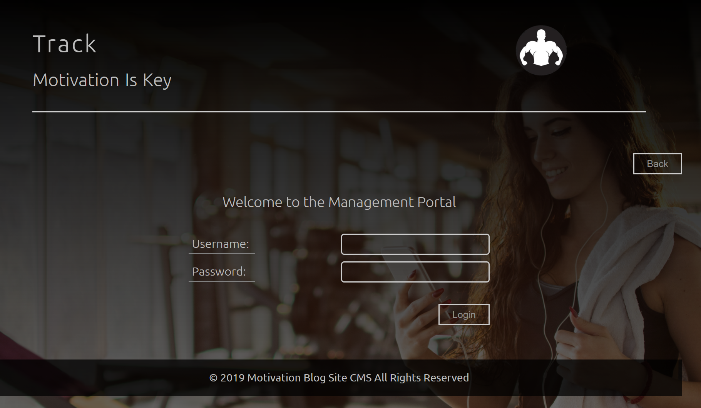
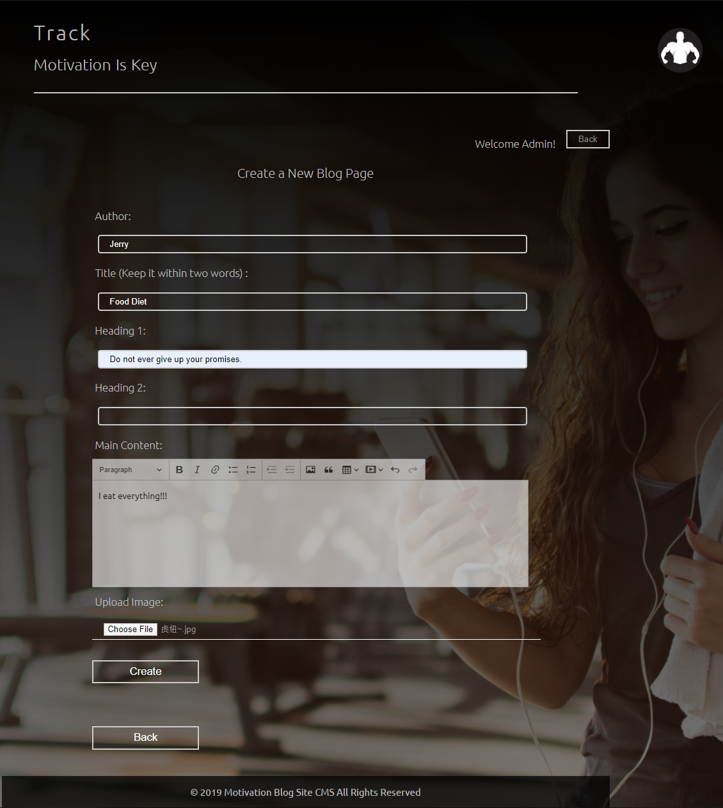
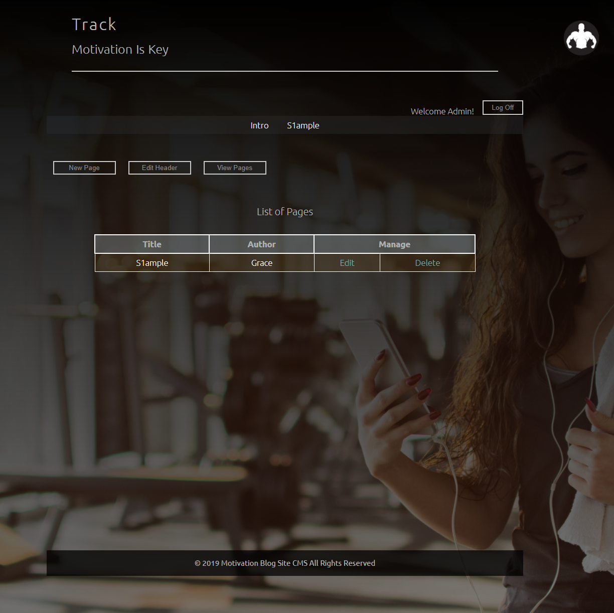

# ContentManagementSystem-Blog
Customizable blog site, allow users to login as admin to add/edit pages/images/logos to their site. 

Front-end
Node.js express for central content management. 
Admin can be assigned to users so they can ---> view add/edit pages and images into their website. 
This system also support changing title text as well as changing logo images. 

Database 
Mongoose library was used to connect and store information of individual pages in MongoDB. 

<h2>Main Page</h2>

<h2>Admin Page</h2>

<h2>New Page</h2>

<h2>Content Page</h2>

